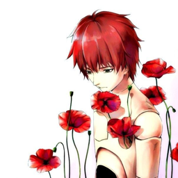

<!DOCTYPE html>
<html lang="en">
<head>
<meta charset="UTF-8">
<header>
  
  <h1><a href="https://guns.lol/lunezo79" target="_blank">Lunezo79</a></h1>
  
Roblox Studio Developer — Modeler | Builder | UI Designerr

</header>

</head>
<body>

  

    
Projects

    

      

        
        <h2>Project Name 1</h2>
        
Short description of what this project is, what you built, and what tools/systems you used.

      

      

        
        <h2>Project Name 2</h2>
        
Short description of what this project is, what you built, and what tools/systems you used.

      

      

        
        <h2>Project Name 3</h2>
        
Short description of what this project is, what you built, and what tools/systems you used.

      

    

    
Skills

    

      

        <h2>Scripting</h2>
        
Lua, DataStores, RemoteEvents, Module Scripts, etc.

      

      

        <h2>Building</h2>
        
Terrain, environment design, lighting, optimization.

      

      

        <h2>UI / UX</h2>
        
Custom GUI design, menus, HUDs, animations.

      

    

  

</body>
</html>
